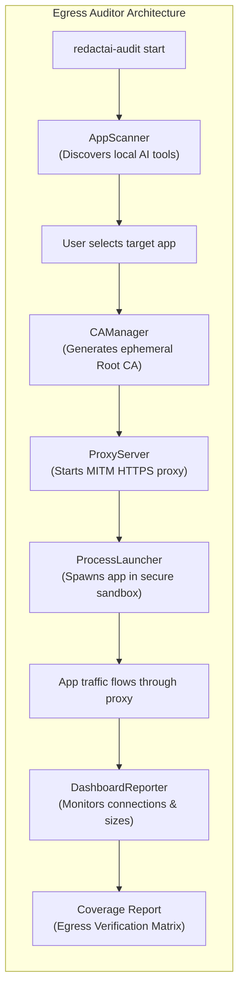

<div align="center">
  <h1>@redactai/cli</h1>
  <p><strong>Egress Coverage Auditor — See exactly what your AI tools are sending to the cloud.</strong></p>

  [](LICENSE)
  [](https://nodejs.org)
  [](https://typescriptlang.org)
  [](CONTRIBUTING.md)

  <p>
    A zero-config, cross-platform diagnostic CLI that discovers AI tools on your machine,<br/>
    launches them in an isolated sandbox, and generates detailed reports on exactly what data<br/>
    they transmit to the cloud — and whether they respect your enterprise DLP policies.
  </p>
</div>

```console
$ redactai-audit start

 🚀 REDACTAI EGRESS AUDITOR 

Initializing CA and TLS Proxy...
✅ Diagnostic Proxy listening on http://127.0.0.1:54321

Scanning for AI applications on this machine...
Discovered 4 AI applications:
  [1] Cursor AI (/Applications/Cursor.app/Contents/MacOS/Cursor)
  [2] VS Code (/Applications/Visual Studio Code.app/Contents/MacOS/Electron)
  [3] Kiro (/Applications/Kiro.app/Contents/MacOS/Kiro)
  [4] Claude Desktop (/Applications/Claude.app/Contents/MacOS/Claude)

Select an app to audit [1-4] or 'm' for manual mode: 1

Selected: Cursor AI
Monitoring for AI traffic... (Press Enter again to stop and generate report)
```

---

## 🛑 The Problem

Many modern AI coding assistants and desktop apps use **certificate pinning**, **custom TLS stacks**, or hardcoded endpoints to actively evade corporate firewalls, VPNs, and standard proxy configurations. 

As a security engineer or developer, you need to know: **Are the AI tools on my machine secretly bypassing my DLP (Data Loss Prevention) rules and leaking proprietary code?**

## 🛡️ The Solution: RedactAI Egress Auditor

The Egress Coverage Auditor is a diagnostic tool that answers this question definitively. It:

1. **Scans** your machine for installed AI applications (Cursor, VS Code + Copilot, Windsurf, Kiro, ChatGPT Desktop, Ollama, etc.)
2. **Launches** the selected tool inside an isolated process sandbox with dynamically injected proxy settings.
3. **Intercepts** all outbound HTTPS traffic using an ephemeral local MITM (Man-In-The-Middle) proxy.
4. **Reports** exactly what data was sent, to which endpoints, and flags if the tool attempted to evade interception.

> **Note:** This CLI is a **read-only diagnostic tool**. It does not modify or scrub your payloads. It simply observes and reports. To actively block and redact sensitive data in real-time, pair this with the RedactAI VS Code Extension.

---

## 🏗️ Architecture



### The Sandbox Interception Strategy

We do **not** modify system-wide proxy settings (which breaks browsers and system updates). Instead, we use process-level environment isolation:

1. `CAManager` creates an ephemeral Root CA in `~/.redactai-cli/`.
2. `ProxyServer` spins up a local MITM proxy on a random open port.
3. `ProcessLauncher` spawns the target binary (e.g., `Cursor.exe`) with injected environment variables (`HTTP_PROXY`, `NODE_EXTRA_CA_CERTS`, `REQUESTS_CA_BUNDLE`) pointing exclusively to our local proxy.
4. All outbound connections from that specific child process are monitored.

---

## 📊 The Egress Verification Matrix

After an audit session, the CLI categorizes the audited tool into one of three coverage tiers:

| Tier | Classification | Security Implication |
|------|---------------|----------------------|
| ✅ **Covered** | Routes through standard proxies and accepts the OS trust store. | Safe for enterprise use. Your existing corporate DLP solutions will work. |
| ⚠️ **Covered (Forced)** | Ignores standard settings but respects environment variables. | Interceptable, but requires environment injection. (The RedactAI CLI handles this automatically). |
| ❌ **Bypass Detected** | Uses custom TLS stacks, pinned certificates, or ignores standard routing. | **High Risk.** Cannot be inspected by traditional proxies. Must be blocked at the network level or intercepted via a TUN/TAP interface (Tier 4). |

---

## 🚀 Installation & Usage

### Prerequisites
- Node.js 18 or higher

### Build and Install Locally

Currently, the CLI is run locally from the source. To set it up:

```bash
# 1. Clone the repository (if you haven't already)
git clone https://github.com/redactai/cli.git
cd cli

# 2. Install dependencies
npm install

# 3. Build the project
npm run build

# 4. Link the package globally
npm link
```

### Start an Audit Session

Once linked globally, you can run the tool from anywhere:

```bash
redactai-audit start
```

**What to expect:**
1. The CLI initializes the proxy and CA.
2. It presents a numbered list of discovered AI tools on your machine.
3. Select a tool, and the CLI will launch it.
4. Use the AI tool normally (send a prompt, request autocomplete).
5. Press `Enter` in the CLI terminal to stop the proxy and generate the final Verification Matrix report.

### Manual Mode

If your specific AI tool is not auto-discovered, select `m` for manual mode. The CLI will provide you with specific `export` commands (e.g., `HTTP_PROXY`, `NODE_EXTRA_CA_CERTS`). You can run these commands in a new terminal, and then manually launch your AI tool from that same terminal to route its traffic through the auditor.

---

## 🛠️ Development & Contributing

We welcome contributions! The project is structured to make development easy and safe.

### Project Structure

```
cli/
├── bin/
│   └── redactai-audit.js  # Executable entrypoint
├── src/
│   ├── commands/          # Commander subcommands (e.g., start.ts)
│   ├── proxy/             # Core MITM proxy and CA manager
│   ├── dashboard/         # Terminal reporter and coverage matrix
│   ├── discovery/         # App scanner (Windows/macOS/Linux paths)
│   ├── launcher/          # Process launcher (sandbox injection)
│   └── index.ts           # Commander.js setup
├── tests/                 # Jest test suites
├── docs/                  # Architecture documentation
├── package.json
├── eslint.config.js       # Strict TypeScript linting rules
└── .prettierrc            # Formatting configuration
```

### Setup Locally

1. Clone the repository: `git clone https://github.com/redactai/cli.git`
2. Install dependencies: `npm install`
3. Build the CLI: `npm run build`
4. Link it globally for testing: `npm link`

### CI/CD Pipeline

When submitting a Pull Request, our GitHub Actions will automatically enforce code quality. Please ensure you run these locally before pushing:

```bash
npm run format   # Format code using Prettier
npm run lint     # Check for TypeScript/ESLint errors
npm run test     # Run the Jest test suite
```

---

## 🔮 Future Vision (Tier 4 Interception)

While the current process-level sandbox covers 90% of tools, highly evasive binaries cannot be intercepted via environment variables alone. 

Our roadmap includes releasing a **Standalone Desktop Service with a TUN/TAP virtual network interface**. This will capture outbound TCP traffic at the OS routing layer (Layer 3/4), providing zero-config interception against *any* binary, regardless of its TLS implementation.

---

## 📄 License

This software is licensed under the **GPLv3 License**, ensuring it remains free and open-source.

**Commercial & Private Exception:**
If you are an enterprise wishing to integrate this tool into a proprietary, closed-source product without being bound by the GPLv3, a commercial dual-license is available. Contact **rahulsingh199914@gmail.com** for details.